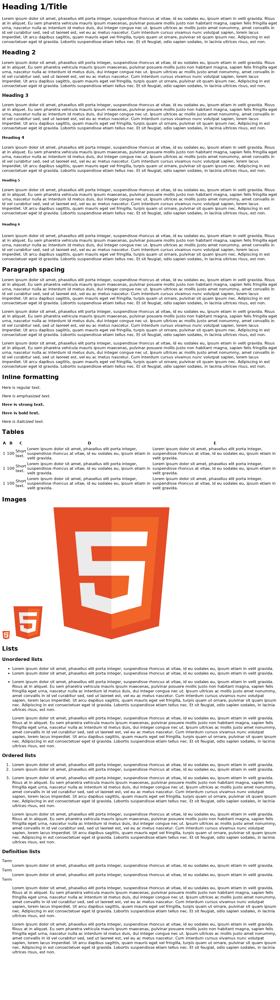
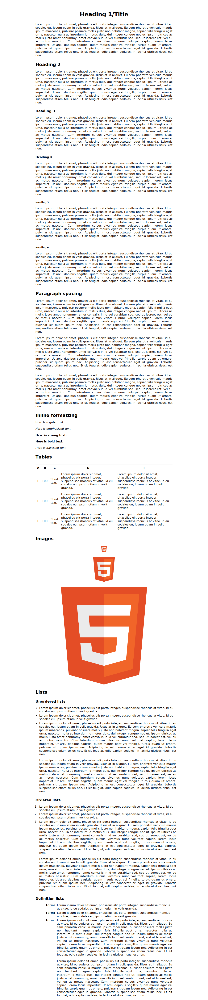

NNCSS
=====

No Nonsense CSS.

A simple CSS file that can be used to "publish" documents written in HTML.

If you can write a document and publish a beautiful version of it using LaTeX,
why can't you do the same with HTML?

Now you can.

Getting started
---------------

If you want to get started immediately, just grab `nncss.css`.

If you are interested in what is in NNCSS and how it was designed, read
`docs/nncss.html` (or [read online][1]).

[1]: https://rawgit.com/darkfeline/nncss/master/doc/nncss.html

If you are interested in the sample HTML used for testing and how it was
designed, read `docs/sample.html`. (or [read online][2])

[2]: https://rawgit.com/darkfeline/nncss/master/doc/sample.html

Pictures
--------

Sample document with default Chrome rendering:

Project files
-------------

NNCSS is written using Org Babel in a literate programming style.  The source
code is in `src/`.  The latest version of Emacs is needed to build NNCSS, but a
Makefile is provided, so you need only run `make` to build everything.

Contributing
------------

Make an issue or pull request.

Keep in mind that for style change or addition requests, the goal of NNCSS is to
provide the simplest CSS file possible to make a well-written HTML document
visually appealing.  For example, I will not add styles to make tables work for
tiling HTML block elements.
